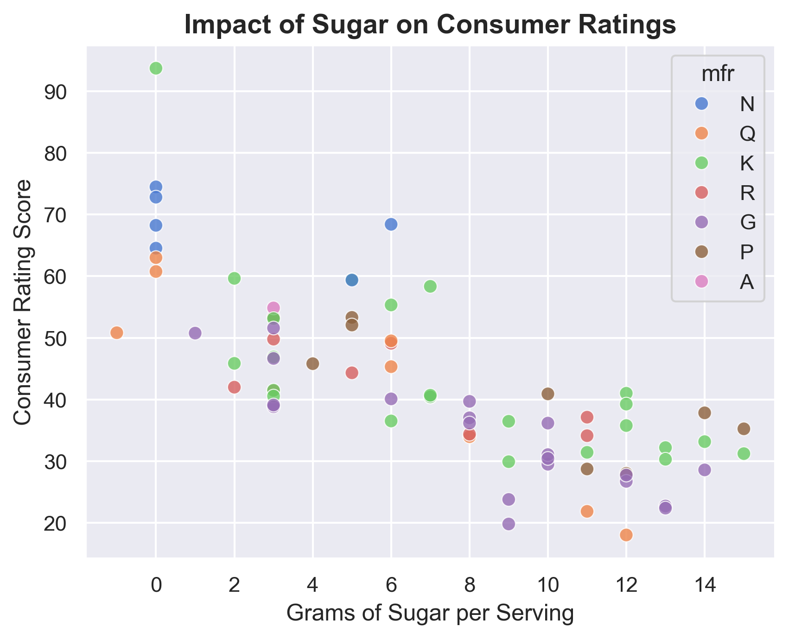
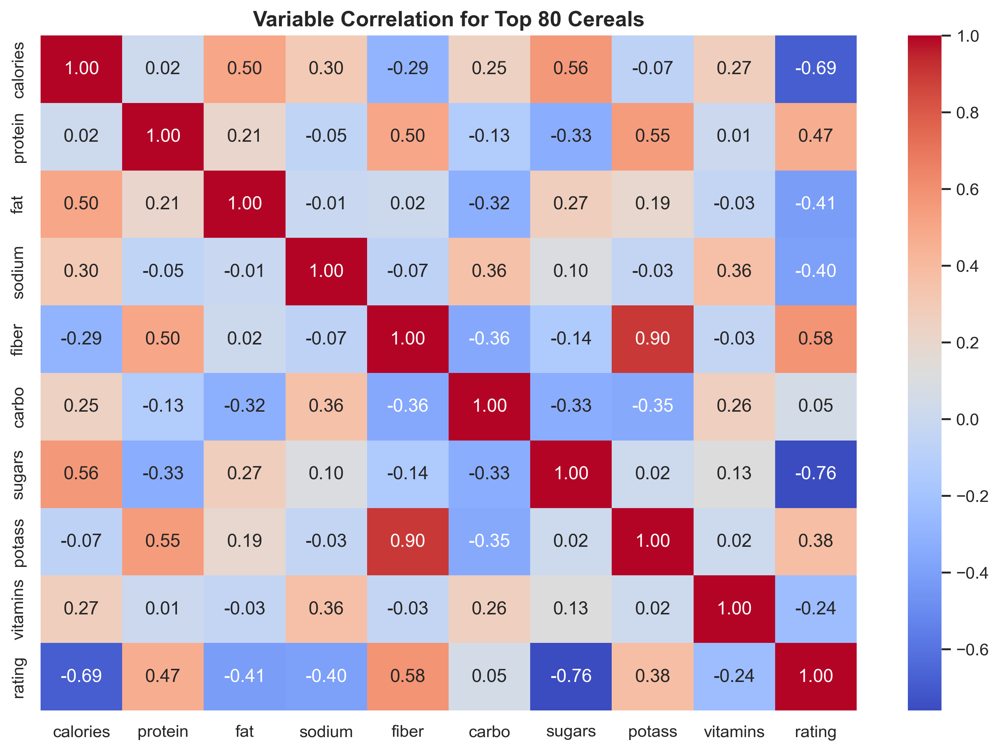
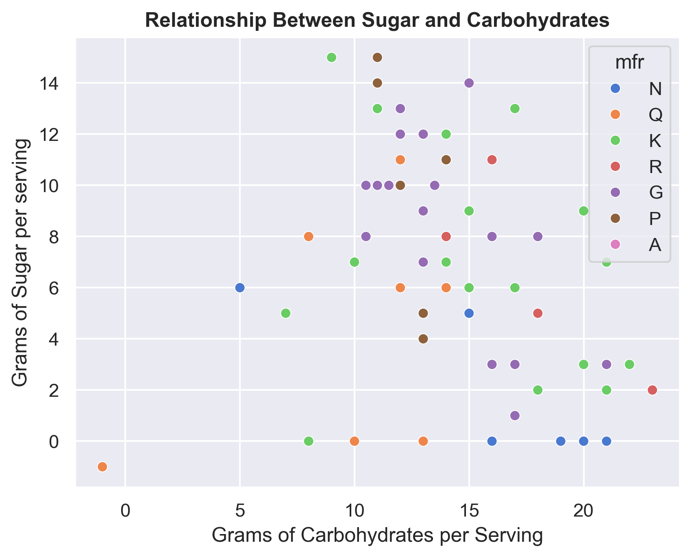
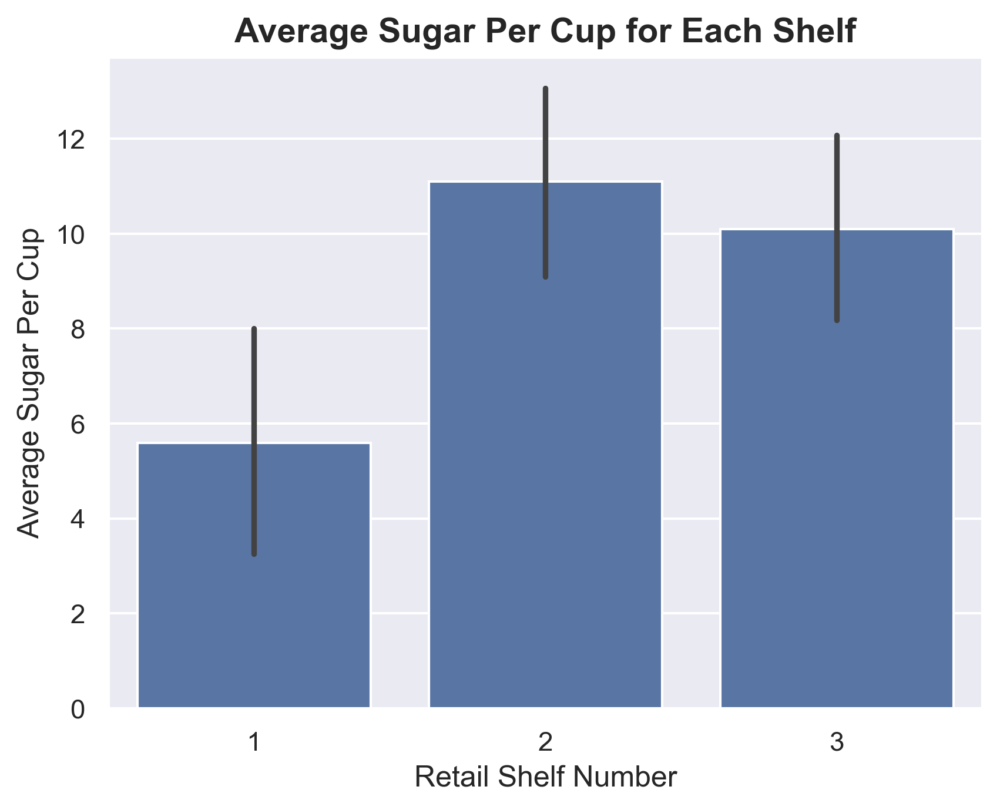
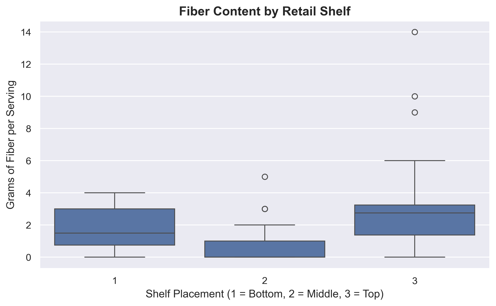

# Cereal Nutrition Analysis: Study on Market Positioning for the Top 80 Cereals

## Executive Summary
This project analyzes nutrition data from the top 80 market cereals to determine nutrient variables that impact consumer ratings, relationships between nutrients, and correlation between shelf placement and a cereal's health value. These findings may benefit both manufacturers seeking to improve consumer ratings as well as consumers learning to look past marketing techniques and make healthier choices.

## Technology and Methods Used
* Language: Python
* Libraries: Pandas, Seaborn, Matplotlib
* Key Techniques: Distribution modeling, multi-variable correlation profiling, categorical data grouping.

## Key Insights and Visualizations
1. Variables Driving Consumer Ratings: 
Findings indicate that total calories and sugars in a cereal both have a significant negative correlation to consumer ratings (-0.69 and -0.76 respectively).

2. Nutrient Pairs: Data suggests that there is a strong positive correlation between potassium and fiber in cereal (0.90 as seen in the heatmap above) and no significant relationship between total grams of sugar and grams of carbohydrates.

3. Retail Shelf Distribution: There is a correlation between average sugar per cup and shelf number in a retail store. Cereals on shelves 3 and 2 had significantly higher average amounts of sugar (both greater than 10g per cup) than shelf 1 (5.6g per cup). It is worth noting that shelf 2 has cereals with a substantially lower average fiber content (0.9g per serving) than shelves 1 and 3, which may suggest that less "healthy" cereals (those higher in sugar and lower in fiber) tend to go on shelf 2. 

